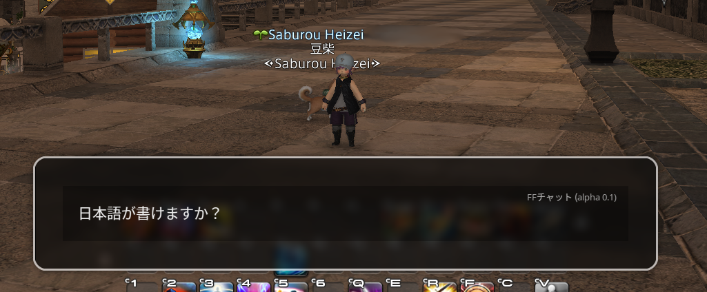

# FFChat

FFChat is an application originally designed to allow writing messages in windows where the IME (Input Method Editor) does not work correctly, such as in the game Final Fantasy XIV. However, as the project has evolved, its future is uncertain and full of possibilities.

## Initial Features

- **Compatibility with Final Fantasy XIV**: Allows writing in the game's chat windows where the IME does not function properly.
- **Intuitive Interface**: Designed to be easy to use and accessible.

## Current State

- **Development in BSPWM**: So far, FFChat has been specifically programmed for the BSPWM window manager.
- **Partial Compatibility**: It may work fully or partially in other Linux desktop environments such as XFCE.

## Project Future

The direction of FFChat is currently flexible and open to multiple possibilities. Here are some ideas and potential future features:

- **Cross-Platform Compatibility**: Implement support for other operating systems.
- **Plugin Interface**: Incorporate an interface that allows users to create and use plugins to expand FFChat's functionality.
- **New Features**: Explore new features that enhance the user experience.
- **Code Restructuring**: The code will be restructured to improve performance and facilitate the addition of new features.

## How to Contribute

The project has been uploaded to receive suggestions and in case anyone needs it until the next version is completed. We are open to community contributions. If you have ideas, improvements, or want to help with development, feel free to open an issue or submit a pull request.

Thank you for your interest in FFChat!
